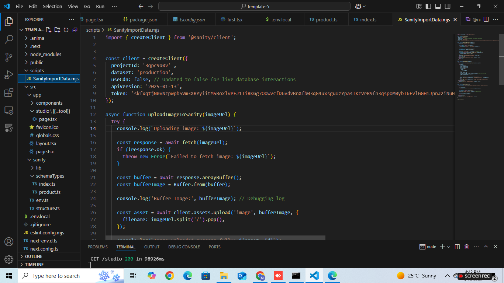
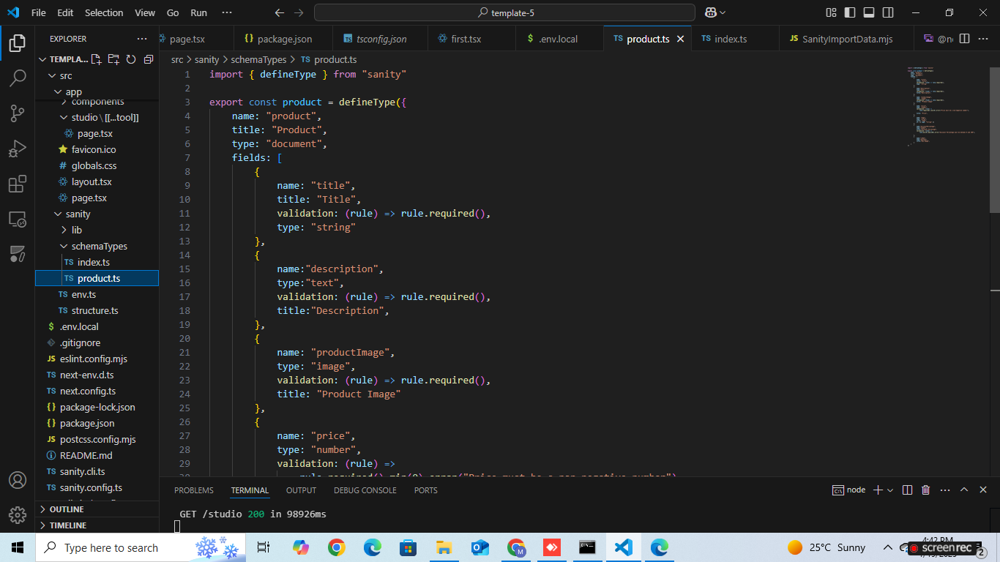
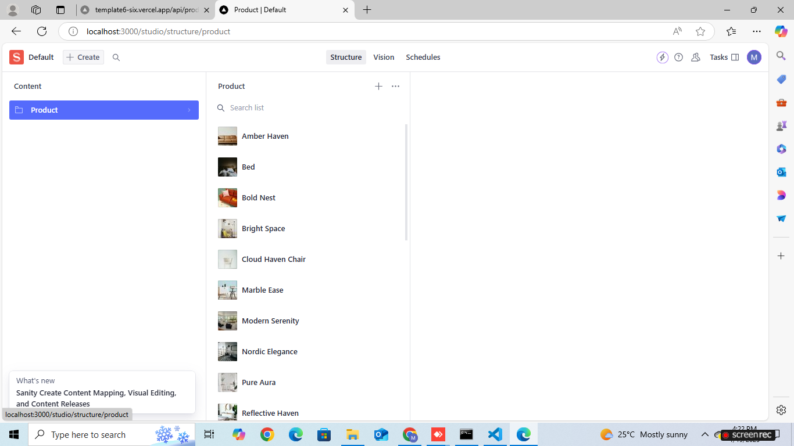

Day-3: API IntergrationReport - [template-5]

## Objective
The objective was to build Template 5 by integrating three key components:

## Schema: Defining the structure of the product data.
API: Fetching product data from an external source.
Migration: Importing the fetched data into Sanity Studio dynamically.
Steps Completed
## 1. Schema Creation
A schema was defined in src/sanity/schemaTypes/product.ts to outline how the product data would be stored and displayed in Sanity Studio.
This schema ensured consistency and validation of the product data.

## 2. Fetching Data from the API
An external API was utilized to fetch product details dynamically, provided by template 5.
The API provided key product attributes, such as title, description, image URLs, price, tags, and discounts.
Data transformation was done to align API responses with the schema structure.
## API Workflow:

Fetched the data using fetch or an HTTP client.
Mapped API fields to the schema fields for compatibility.
## 3. Data Migration
A migration script was created using Sanity's @sanity/client to import the API data into the Studio.
The script ensured data validation and successfully pushed API data into the Product document type in Sanity Studio.

##Migration Highlights:

All required fields were populated (e.g., title, description, image, price).
Optional fields like tags and discountPercentage were handled gracefully.
Errors in data validation were logged for debugging.
## 4. Product Rendering in Sanity Studio
After migration, Sanity Studio was started using the sanity start command.
The product data was successfully rendered under the Product document type.
Each product was displayed with its respective attributes as per the schema.

# Screenshots

## Thorugh Sanity 
(./id-tokenapi.png)

## API Integration
.png)

## Migration Script Output

## Sanity Schema

## Sanity Studio

## Conclusion
By combining Migration, API, and Schema, Template 5 was successfully implemented in Sanity Studio. The integration provided a seamless way to manage, update, and display dynamic product data, making the system robust and efficient.

